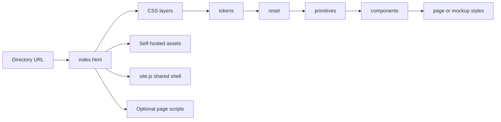

# Landing-Page Architecture

This repository is both the public source for the Tradign marketing site and a
working example of a maintainable landing page built without a framework.

“No build step” describes the toolchain, not the quality of the result. A good
static site still needs deliberate structure, reusable design decisions,
accessible HTML, disciplined JavaScript, useful validation, and honest content.

## 1. When this architecture is a good fit

Plain HTML, CSS, and JavaScript are a strong default when a site primarily:

- explains a product or business;
- has a manageable number of editorial pages;
- does not render private or personalized data on the server;
- needs fast, portable static hosting;
- benefits from being easy to inspect and edit; and
- does not need a dependency graph just to render content.

The practical advantages are simple:

- **Direct delivery:** the browser receives the files you wrote.
- **Portability:** any static host that supports directory index files can run
  the site.
- **Auditability:** there is no generated bundle hiding what ships.
- **Small supply-chain surface:** there are no runtime packages to install or
  update.
- **Cacheability:** HTML, CSS, JavaScript, fonts, and images are ordinary static
  assets.
- **Low contributor friction:** a change needs an editor, a browser, and Node
  only for validation.

These qualities create the conditions for a fast site; they do not guarantee
performance. Image weight, font loading, CSS complexity, JavaScript work, and
hosting still need to be measured.

## 2. Browser and file flow



A route such as `/platform/about/` maps to
`platform/about/index.html`. Every page owns its semantic content and metadata.
Shared navigation and footer markup are mounted by `_landing/js/site.js`.

The scripts have distinct responsibilities:

- `site.js` renders the shared header and footer, manages navigation state, and
  adjusts application CTAs when a same-origin Tradign session is detected.
- `script.js` contains homepage interactions.
- `mockup.js` runs the optional visual product demonstration.

The `/api/v1/auth/me` request in `site.js` is a Tradign-specific same-origin
integration. A derivative site should remove it or replace it with its own
documented endpoint.

## 3. Repository map

```text
.
├── index.html                    # Homepage
├── platform/                     # Product and trust pages
├── solutions/                    # Use-case pages
├── resources/                    # Docs, guides, FAQ, changelog
├── legal/                        # Product-specific legal pages
├── _landing/
│   ├── assets/                   # Fonts, favicon, social image
│   ├── styles/                   # CSS layers
│   └── js/                       # Shared and optional behavior
├── scripts/validate-static.mjs   # Dependency-free public-file validation
├── sitemap.xml
├── robots.txt
└── .github/workflows/validate.yml
```

The private application, production configuration, deployment automation,
credentials, and customer data do not belong in this repository.

## 4. CSS architecture

CSS is split by responsibility rather than by arbitrary file size.

| Layer | File | Responsibility |
| --- | --- | --- |
| 1 | `tokens.css` | Brand colors, typefaces, spacing, radii, weights, motion, responsive gutters, light/dark values |
| 2 | `reset.css` | Box sizing, base browser behavior, typography defaults, focus, selection, reduced motion |
| 3 | `primitives.css` | Generic reusable layout, visibility, scrolling, and control patterns |
| 4 | `components.css` | Shared shell and recognizable homepage components |
| 5 | `pages.css` | Inner-page typography and page-specific presentations |
| 6 | `mockup.css` | Optional product simulator; loaded only where the demo appears |

The load order is intentional:

- Homepage: tokens → reset → primitives → components → mockup.
- Standard inner page: tokens → reset → primitives → components → pages.
- Demo solution pages add mockup last.

Each stylesheet uses a separate `<link>` element. This keeps the dependency
order visible while allowing the browser to discover the files without an
`@import` chain.

### Tokens: shared design decisions

A token is a repeated design decision, not a storage place for every number.
Examples from `tokens.css` include:

- semantic surfaces: `--bg`, `--surface`, `--surface-2`;
- semantic text: `--text`, `--text-2`, `--text-3`;
- feedback: `--accent`, `--success`, `--error`, `--focus-ring`;
- spacing: `--sp-1` through `--sp-10`;
- radii, border widths, font weights, and transition speeds; and
- layout decisions such as `--max-w`, `--gutter`, and `--header-h`.

Prefer semantic names over page names or raw color names. A component should
ask for “secondary text,” not “gray 500.” Dark and light schemes can then
change the value without changing the component.

Add a token when the same decision is used repeatedly or must change as one
system. A one-off illustration coordinate does not need a global token.

### Reset: browser consistency only

`reset.css` owns global browser behavior: box sizing, base margins, typography,
focus visibility, selection, overflow model, and reduced-motion safeguards. It
must not contain product-card, hero, pricing, or navigation styling.

### Primitives: reusable behavior and layout

A primitive should:

- solve one predictable problem;
- work across multiple pages;
- stay neutral to product copy and page meaning;
- consume tokens rather than hard-coded brand values;
- compose with other classes;
- work with keyboard focus and both color schemes; and
- respond intrinsically where possible.

The current primitives are:

| Primitive | Purpose |
| --- | --- |
| `.container` | Centers content and applies the shared max-width and gutter |
| `.cluster` | Wraps related items horizontally with a configurable gap |
| `.visually-hidden` | Keeps useful text available to assistive technology |
| `.no-scrollbar` | Hides a nested scrollbar without removing scrolling |
| `.skip-link` | Lets keyboard users jump directly to main content |
| `.button` | Shared interactive shape and focus behavior |
| `.button-light`, `.button-dark` | Theme-aware variants extending `.button` |

Composition is preferred over a new component for every arrangement:

```html
<div class="container">
  <div class="cluster cta-actions">
    <a class="button button-light" href="/start">Start building</a>
    <a class="button button-dark" href="/docs">Read docs</a>
  </div>
</div>
```

```css
.cta-actions {
  --cluster-gap: var(--sp-3);
}
```

The component supplies context; `.cluster` remains reusable.

### How to create a new primitive

1. Notice the same layout or behavior in at least two real places.
2. Confirm an existing primitive cannot express it through composition.
3. Add a token only if a design decision is genuinely shared.
4. Name the primitive by what it does, not where it first appeared.
5. Replace the repeated implementations.
6. Test narrow and wide screens, keyboard focus, reduced motion, and both color
   schemes.

For example, add a vertical stack only after vertical rhythm is repeating:

```css
.stack {
  display: grid;
  gap: var(--stack-gap, var(--sp-4));
}
```

Do not add speculative primitives “for later.” Unused abstraction makes a small
site harder to understand.

### Components and page styles

A component owns recognizable UI: a header, hero, comparison table, carousel,
FAQ treatment, or CTA region. Components may compose primitives but should not
duplicate their base behavior.

In this repository:

- `pg-*` classes form the shared inner-page vocabulary;
- `px-*` classes represent distinctive inner-page presentations;
- homepage component names live in `components.css`; and
- product-simulator selectors stay isolated in `mockup.css`.

Use classes for styling and `data-*` attributes for JavaScript hooks. Promote a
page style upward only after it becomes a shared pattern.

## 5. HTML and page design

An effective landing page is content hierarchy expressed through semantic HTML.
A strong default narrative is:

1. **Promise:** say who the product is for and what changes for them.
2. **Evidence:** show the workflow, result, proof, or product surface.
3. **Details:** answer risk, pricing, capability, and comparison questions.
4. **Action:** offer one clear primary next step.

Each page should have:

- one descriptive `h1` followed by ordered headings;
- `header`, `nav`, `main`, `section`, `article`, and `footer` landmarks where
  they match the content;
- readable line lengths and consistent section rhythm;
- real links for navigation and real buttons for actions;
- useful text in HTML rather than hidden inside JavaScript; and
- decorative visuals hidden from assistive technology while meaningful media
  receives a useful text alternative.

Every document head should include a unique title and description, canonical
URL, Open Graph fields, Twitter card fields, theme colors, favicon, required
font preloads, and the CSS layers in their documented order.

The shared body shape is:

```html
<header class="header" data-site-header></header>
<section class="site-frame">
  <main>
    <!-- Page-owned semantic content -->
  </main>
  <footer data-site-footer></footer>
</section>
```

`site.js` assigns the main-content target used by the skip link. Because the
header and footer are JavaScript-mounted, they disappear when JavaScript is
disabled; the page-owned core content remains. This is an explicit simplicity
tradeoff. A static-site generator is the better next step if shared markup must
also work without JavaScript.

## 6. Accessibility rules

- Prefer native HTML controls over custom roles.
- Keep a visible `:focus-visible` state.
- Keep the skip link as the first keyboard focus target.
- Synchronize `aria-expanded`, `aria-current`, labels, and visual state.
- Support Escape for dismissible navigation.
- Respect `prefers-reduced-motion` for animation and smooth scrolling.
- Test dark and light color schemes; theme-specific hover states can fail even
  when the default theme looks correct.
- Do not use color as the only way to communicate status.
- Test at 360px, a tablet width, and a wide desktop—not only one screenshot.

Accessibility is part of the component contract, not a cleanup step.

## 7. JavaScript boundaries

Keep each feature small and independently guarded:

```js
(function () {
  "use strict";

  var root = document.querySelector("[data-example]");
  if (!root) return;

  // Behavior for this feature only.
})();
```

Guidelines:

- avoid global state and runtime dependencies;
- keep essential copy and links in HTML;
- use `data-*` attributes for behavior hooks;
- keep visual and ARIA state synchronized;
- exit immediately when the feature root is absent;
- load `mockup.js` only on pages that use the demo; and
- replace Tradign-specific endpoints before adapting the starter.

A framework becomes useful when state, rendering, forms, and client routing are
the actual product—not merely because a page has a menu or carousel.

## 8. Running locally

From the repository root:

```bash
python3 -m http.server 8101
```

Open `http://127.0.0.1:8101/`.

Use an HTTP server instead of opening `index.html` through `file://`; directory
routes and same-origin browser behavior are then closer to production.

Node.js is used only for validation:

```bash
node --check _landing/js/site.js
node --check _landing/js/script.js
node --check _landing/js/mockup.js
node --check scripts/validate-static.mjs
node scripts/validate-static.mjs
git diff --check
```

The validator checks the public file allowlist, forbidden private-file patterns,
HTML titles, canonical and Open Graph URLs, internal links, social-image shape,
and sitemap coverage.

## 9. Adding a page

1. Create `section/page/index.html` so the public URL can end in `/`.
2. Copy the nearest inner-page skeleton.
3. Correct the relative asset depth, usually `../../_landing/...`.
4. Write a unique title, description, canonical URL, Open Graph data, and
   Twitter card data.
5. Use semantic content and existing primitives first.
6. Add page styling to `pages.css` only when the design is genuinely specific.
7. Add navigation in `site.js` only if users need it globally.
8. Add the canonical URL to `sitemap.xml`.
9. Add the HTML file to `requiredPaths` in `scripts/validate-static.mjs`.
10. Run all checks and open the directory URL locally.

If a shared asset changes and production caches it for a long time, update its
`?v=` query value consistently or use a host-level cache policy. A future build
step may introduce content hashes when manual cache versions become unreliable.

## 10. SEO and social sharing

Search and share metadata are page content, not deployment decoration.

- Canonical URLs must point to the final public domain.
- Open Graph and Twitter fields should describe the actual page.
- The social image should remain readable when cropped and displayed small.
- `sitemap.xml` must contain every canonical public page exactly once.
- `robots.txt` must reference the correct sitemap and must not expose internal
  routes.
- Derivative sites must replace every Tradign URL and contact address.

Run the validator after every route or metadata change.

## 11. Security and privacy

A public static repository must contain no secrets, environment files, customer
data, internal runbooks, private source, or deployment credentials.

Static hosting removes server code from this repository; it does not configure
security headers for you. Configure Content Security Policy, HSTS, referrer
policy, MIME protections, and caching at the chosen host. External links opened
in a new tab should retain `rel="noopener"`.

Do not copy the included legal pages into another business unchanged. They are
Tradign-specific examples, not general legal advice.

## 12. Deployment

The repository root is the publish directory. There is no build output folder.
Any static host supporting directory index files can serve it, including GitHub
Pages, Cloudflare Pages, object storage plus a CDN, or nginx.

Before deployment, verify:

- directory routes resolve to their `index.html` files;
- canonical URLs, sitemap, robots, and social images use the final domain;
- HTML has a conservative cache policy;
- versioned assets can be cached longer; and
- application-owned paths such as `/ai` and `/api/` route to the correct service.

Publishing this source repository does not deploy `tradign.com`. The production
site has a separate private deployment path.

## 13. When to graduate from this architecture

Adopt a static-site generator, CMS, or application framework when a concrete
need appears, such as:

- hundreds of pages or multiple locales;
- nontechnical authors needing structured content editing;
- repeated head or shell markup becoming error-prone;
- server-rendered personalization;
- complex authenticated forms and application state;
- automatic asset hashing, optimization, or content pipelines; or
- multiple teams colliding frequently in shared files.

Keep the durable parts when you migrate: semantic content, tokens, primitives,
accessibility contracts, metadata discipline, and targeted validation.

## 14. Design review checklist

Before publishing a landing-page change, confirm:

- [ ] The first viewport states the audience, outcome, and primary action.
- [ ] Evidence follows claims; illustrative numbers are labelled.
- [ ] One `h1` and ordered headings describe the page structure.
- [ ] Repeated decisions use tokens and repeated patterns use primitives.
- [ ] One-off page visuals have not leaked into the primitive layer.
- [ ] Keyboard navigation, focus, skip navigation, and Escape work.
- [ ] Dark mode, light mode, and reduced motion work.
- [ ] 360px, tablet, and wide desktop layouts have no accidental overflow.
- [ ] Titles, descriptions, canonical URLs, social metadata, links, and sitemap
      entries are correct.
- [ ] The browser console is clean and the validation commands pass.
- [ ] No private data, internal paths, or credentials are tracked.

Simple architecture stays good by enforcing simple boundaries.
